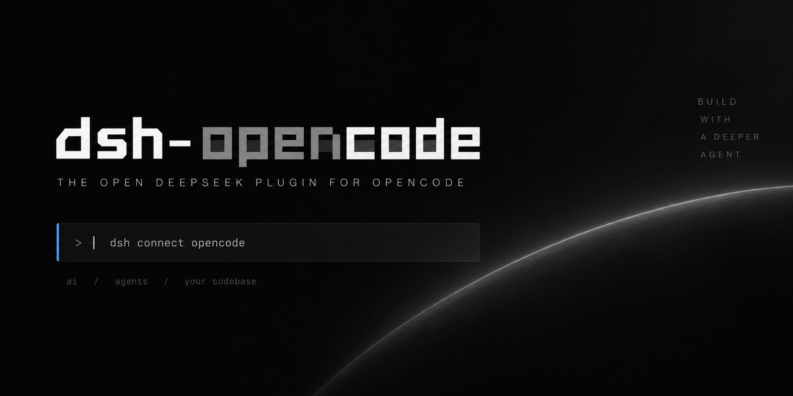

# dsh-opencode-session



[](https://github.com/BrackRat/dsh-opencode-session/actions/workflows/test.yml)
[](LICENSE)
[](https://github.com/deepseek-ai/deepseek-harness)

[DeepSeek Harness](https://github.com/deepseek-ai/deepseek-harness)（`dsh`）
插件：修复 opencode.ai 网关（Console Go）返回的 **`400 MissingSessionID`** ——
为所有 `opencode` / `opencode-go` 请求补上 `x-opencode-session` 请求头。

**搜索关键词**：`dsh 插件` · `dsh plugin` · `DeepSeek Harness` · `opencode` ·
`opencode-go` · `x-opencode-session` · `MissingSessionID` · `会话 ID` ·
`Console Go` · `400` · `cannot be routed efficiently` · `pi-ai` · `dsh-plugin`

## 问题

Console Go 网关要求请求携带会话标识头之后，从 dsh 发起的每一次
`opencode` / `opencode-go` 模型调用都会失败：

```
400: {"type":"MissingSessionID","message":"Error from provider (Console Go):
Request is missing x-opencode-session and cannot be routed efficiently. Please
see https://opencode.ai/docs/go/#where-can-i-use-it"}
```

（中文常见描述：`Console Go 缺少会话 ID`、`400 MissingSessionID`、`请求缺少
x-opencode-session`）

该头用于标识请求属于哪个会话，网关据此把请求路由到持有该会话缓存的节点。
pi coding agent 在自身的 provider-attribution 层发送了这个头；但 dsh 在这些
路由上使用的共享库（`@earendil-works/pi-ai` 0.85.1）尚未实现，因此这个问题
是 dsh 特有的。

本插件用于补齐这个能力。

## 安装

```bash
# 从 GitHub 安装（现在就能用）
dsh plugin --profile web add github:BrackRat/dsh-opencode-session

# 从 npm 安装（发布后）
dsh plugin --profile web add dsh-opencode-session

# 从本地目录或 tarball 安装
dsh plugin --profile web add /path/to/dsh-opencode
dsh plugin --profile web add ./dsh-opencode-session-0.1.0.tgz
```

包内声明了 `dsh.bundle`，因此 `dsh plugin add` 会自动把它加入
`dsh.profile.bundles`，无需手改 profile。装完重启 `dsh web` 即可。

## 常见问题

### 它能修好 `dsh web` 里的 `400 MissingSessionID` 吗？

能。装好后重启服务 UI 的那个 dsh 进程，之后所有 `opencode` / `opencode-go`
请求都会带上该头，网关正常路由。

### 为什么 pi 能用，dsh 不行？

pi 在自身的 provider-attribution 层为 `opencode` / `opencode-go` 发送了
`x-opencode-session`（以及 `x-opencode-client: pi`）。dsh 通过
`@earendil-works/pi-ai` 访问同一个网关，而该库尚未实现这个头。本插件在 dsh
内部补上这一环。

### 它会改文件、凭据或设置吗？

不会。它是一个标准的 dsh 插件 bundle：安装进 profile，注册一条 `llm/stream`
中间件，并在内存中包装正在使用的 pi-ai `Models` prototype。dsh 进程之外不做
任何修改；每次启动自动重装，dsh 升级无需任何操作；卸载后不留痕迹。

### 覆盖哪些路由和模型？

`opencode`、`opencode-go`，以及任何 baseUrl 位于 `opencode.ai` 的模型——与
pi coding agent 的判断一致。其它 provider（DeepSeek 官方、Anthropic、OpenAI
等）完全不受影响。

### 和我自己配置的头冲突吗？

不会：你在 provider 或 model 上显式设置的 `x-opencode-session` 优先，插件只在
缺失时补位。当 pi-ai 上游自己实现了该头后，本插件自动变成 no-op，可以卸载。

### 有测试吗？

9 个单元测试（`node --test`，零依赖）覆盖路由判断、header 优先级、prototype
包装与失败安全路径，开发期间另做过针对真实 `opencode-go` 模型的端到端验证。

## 验证

```bash
dsh --profile web --dump-config | grep -A 2 opencode-session-header
```

组合后的树里应能看到该插件条目；用 opencode-go 模型对话应正常回复而不再报
`MissingSessionID`。

## 卸载

```bash
dsh plugin --profile web remove dsh-opencode-session
```

## 工作原理

- 插件注册在 dsh 官方的 `llm/stream` waterfall 上（模型调用的文档化拦截点）。
- 每次请求前，从即将处理该请求的 adapter 上取到**正在使用的那份** pi-ai
  `Models` 实例，对它的 prototype 安装一次包装（幂等，进程内只装一次）。
- 包装器为 opencode 路由注入 `x-opencode-session: <会话 ID>` 与
  `x-opencode-client: dsh`。
- pi-ai 在三种协议（`openai-completions`、`anthropic-messages`、
  `openai-responses`）中都会**最后**合并 `options.headers`，因此显式配置的
  header 始终优先。
- 失败安全：如果未来 dsh 或 pi-ai 内部结构变化，插件只记一条 warning 并让位，
  绝不弄挂请求。

## 兼容性

已在 dsh `0.1.5-rc.1` + `@earendil-works/pi-ai` `0.85.1` 上验证
（`opencode-go` 的 DeepSeek V4 Pro / V4 Flash，`openai-completions` 协议）。

## 开发

```bash
npm test        # node:test，零依赖
npm pack        # 查看实际发布的文件集合
```

## 许可证

MIT
